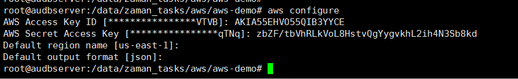
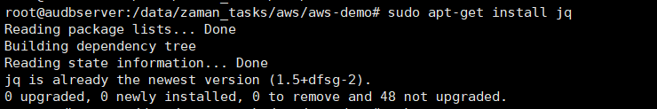
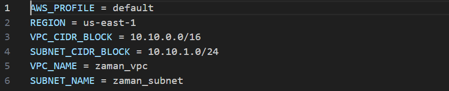
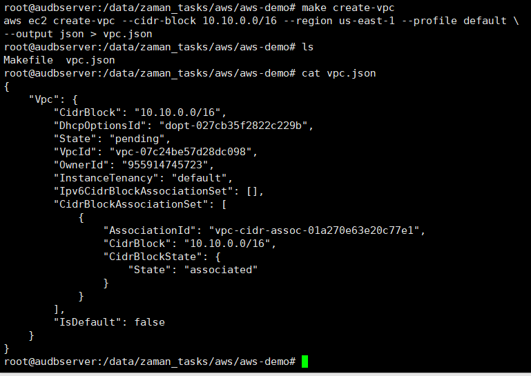
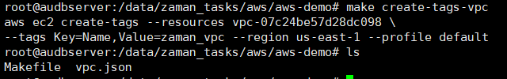
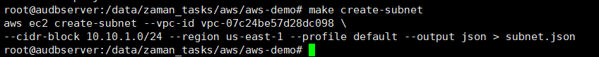
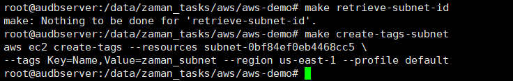
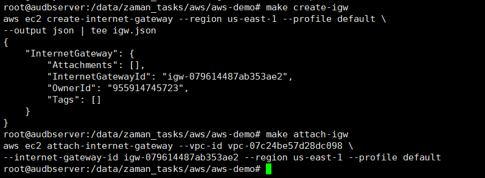
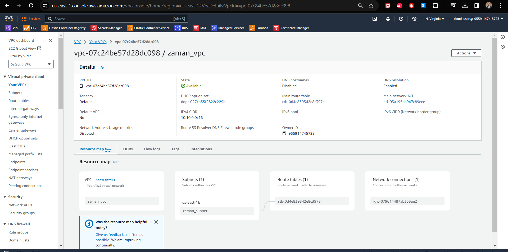

AWS is Amazon\'s robust cloud computing platform offering a variety of
on-demand services for storage, computing power, and more. In this
article we will **deploy VPC, Subnet and IGW** in AWS from a Makefile.
Let's first get familiar with the terminologies:

**VPC (Virtual Private Cloud):** A VPC is a virtual network that you
create within AWS, providing you with control over your AWS environment.
It allows you to define a virtual network topology, including IP address
ranges, subnets, routing tables, network gateways, and security
settings. It enables you to launch AWS resources, such as EC2 instances
or RDS databases, within a defined virtual network.

**EC2 (Elastic Compute Cloud)** is a core service provided by Amazon Web
Services (AWS) that offers resizable compute capacity in the cloud. An
EC2 instance is a virtual server running in the AWS cloud, allowing
users to rent virtual machines (VMs) to run applications.

**Subnet:** A subnet is a segmented section of a VPC\'s IP address
range. It divides the VPC\'s IP address range into smaller parts,
allowing you to organize resources and control network traffic more
effectively. Subnets are associated with specific availability zones
within a region and can be public (accessible from the internet) or
private (accessible only within the VPC or through a VPN connection).

**IGW (Internet Gateway):** An IGW is a AWS component that allows
communication between instances within a VPC and the internet. It
enables internet access for resources in public subnets, facilitating
inbound and outbound traffic to and from the internet.

**Makefile** is a script containing a set of directives used with the
make build automation tool. It defines rules to execute tasks,
specifying dependencies and commands for building software or performing
other actions. It typically includes instructions for compiling code,
managing files, running tests, and more, aiding in automating software
development processes.

First, we need to do *aws configure* on our local machine which will
authenticate us to run CLI commands in AWS. Details:
<https://docs.aws.amazon.com/cli/latest/userguide/getting-started-install.html>

{width="6.5in" height="0.9909722222222223in"}

Now we need to install jq on local machine to read the json file and
extract some parameters.

{width="6.5in" height="1.0805555555555555in"}

Now let's start building the makefile!

{width="6.5in" height="1.3222222222222222in"}

AWS_PROFILE = default

REGION = us-east-1

VPC_CIDR_BLOCK = 10.10.0.0/16

SUBNET_CIDR_BLOCK = 10.10.1.0/24

VPC_NAME = zaman_vpc

SUBNET_NAME = zaman_subnet

Create a VPC with the specified CIDR blocks:
[doc](https://docs.aws.amazon.com/cli/latest/reference/ec2/create-vpc.html)

Step 1: Create VPC

create-vpc:

    aws ec2 create-vpc \--cidr-block \$(VPC_CIDR_BLOCK) \--region
\$(REGION) \--profile \$(AWS_PROFILE) \\

    \--output json \> vpc.json

This command uses AWS Command Line Interface (CLI) to create a Virtual
Private Cloud (VPC) in AWS with a specified CIDR block (IP address
range) defined by the variable \$(VPC_CIDR_BLOCK) in a designated region
specified by \$(REGION) using the default profile \$(AWS_PROFILE). The
command outputs the details of the created VPC in JSON format and saves
it into a file named vpc.json.

create-tags-vpc:

    aws ec2 create-tags \--resources \$(shell jq -r \'.Vpc.VpcId\'
vpc.json) \\

    \--tags Key=Name,Value=\$(VPC_NAME) \--region \$(REGION) \--profile
\$(AWS_PROFILE)

Step 2: Create Subnet

We are creating tag using the VpcId stored in generated json file.

retrieve-subnet-id:

    \$(eval SUBNET_ID := \$(shell aws ec2 describe-subnets \--filters
Name=vpc-id,Values=\$(shell jq -r \'.Vpc.VpcId\' vpc.json) \--region
\$(REGION) \--profile \$(AWS_PROFILE) \--query \'Subnets\[0\].SubnetId\'
\--output text))

create-subnet:

    aws ec2 create-subnet \--vpc-id \$(shell jq -r \'.Vpc.VpcId\'
vpc.json) \\

    \--cidr-block \$(SUBNET_CIDR_BLOCK) \--region \$(REGION) \--profile
\$(AWS_PROFILE) \--output json \> subnet.json

create-tags-subnet:

    aws ec2 create-tags \--resources \$(SUBNET_ID) \\

    \--tags Key=Name,Value=\$(SUBNET_NAME) \--region \$(REGION)
\--profile \$(AWS_PROFILE)

Step 3: Create IGW

create-igw:

    aws ec2 create-internet-gateway \--region \$(REGION) \--profile
\$(AWS_PROFILE) \\

    \--output json \| tee igw.json

   

attach-igw:

    \$(eval IGW_ID := \$(shell jq -r
\'.InternetGateway.InternetGatewayId\' igw.json))

    aws ec2 attach-internet-gateway \--vpc-id \$(shell jq -r
\'.Vpc.VpcId\' vpc.json) \\

    \--internet-gateway-id \$(IGW_ID) \--region \$(REGION) \--profile
\$(AWS_PROFILE)

And filany add phony in make file.

.PHONY: create-vpc create-tags-vpc retrieve-subnet-id create-subnet
create-tags-subnet create-igw attach-igw

To run the makefile:

-   Go to Makefile directory,

-   Run: make create-vpc

{width="6.5in" height="4.606944444444444in"}

-   create-tags

{width="6.5in" height="1.0159722222222223in"}

-   create-subnet

{width="6.5in" height="0.6208333333333333in"}

-   Get SUBNET_ID and create tags-subnet

{width="6.5in" height="1.0333333333333334in"}

-   Create and attach IGW

{width="6.5in" height="2.3895833333333334in"}

Our VPC is created

{width="6.5in" height="1.7027777777777777in"}

{width="6.5in" height="3.229861111111111in"}
