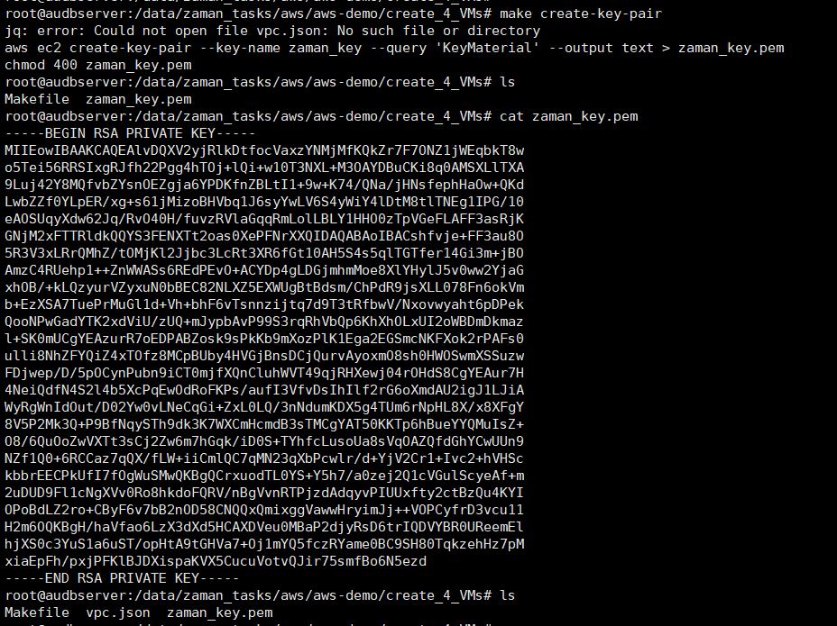
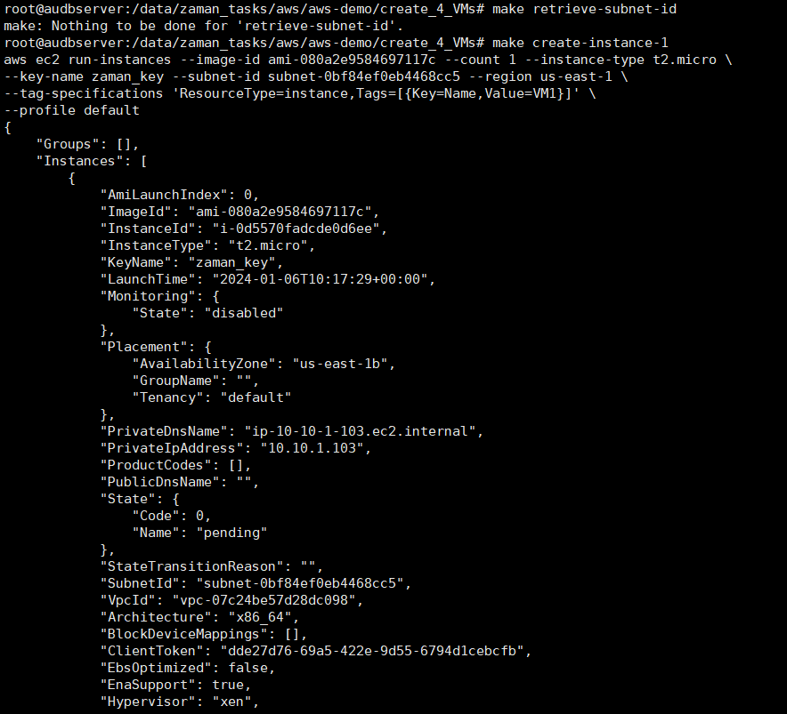
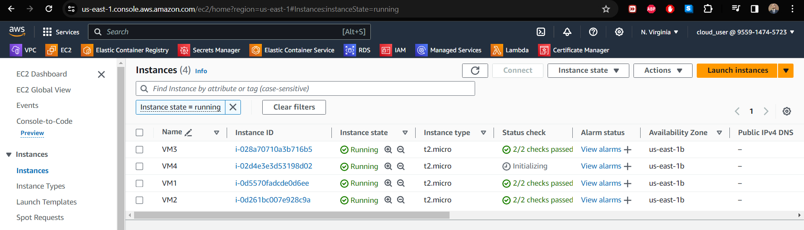

# We will Deploy 4 VMs on AWS using Makefile

**To run the makefile:**

-   Define necessary variables:

AWS_PROFILE = default

REGION = us-east-1

INSTANCE_TYPE = t2.micro

AMI_ID := \$(shell aws ec2 describe-images \--owners amazon \--filters
\"Name=architecture,Values=x86_64\" \"Name=root-device-type,Values=ebs\"
\"Name=virtualization-type,Values=hvm\" \--query \"Images\[0\].ImageId\"
\--output text)

-   Create key-pair

{width="6.5in" height="4.868055555555555in"}

-   Copy previous generated vpc.json file in this directory

-   Get subnet id and create VM-1

{width="6.5in" height="5.904166666666667in"}

-   Similarly create other VMs

make create-instance-2

make create-instance-3

make create-instance-4

{width="6.5in" height="1.8631944444444444in"}
