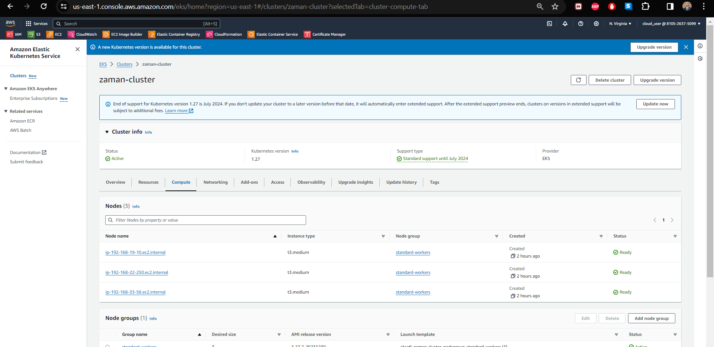
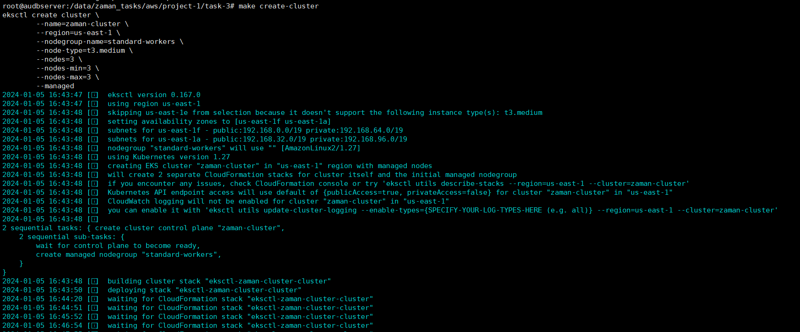
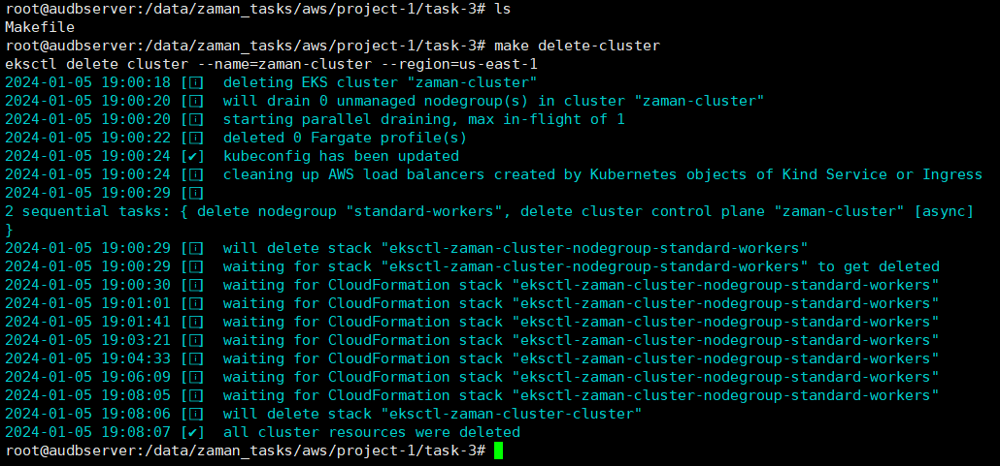

# Launch Kubernetes Cluster Using 3 VMs

This guide demonstrates deploying a Kubernetes cluster using 3 VMs on AWS via a Makefile.

**Makefile Commands:**

- Define necessary variables:
    ```makefile
    CLUSTER_NAME := zaman-cluster
    AWS_REGION := us-east-1
    NODE_COUNT := 3
    ```

- **Create Cluster:**

    ```makefile
    .PHONY: create-cluster

    create-cluster:
        eksctl create cluster \
            --name=$(CLUSTER_NAME) \
            --region=$(AWS_REGION) \
            --nodegroup-name=standard-workers \
            --node-type=t3.medium \
            --nodes=$(NODE_COUNT) \
            --nodes-min=$(NODE_COUNT) \
            --nodes-max=$(NODE_COUNT) \
            --managed
    ```

- **Delete Cluster:**

    ```makefile
    .PHONY: delete-cluster

    delete-cluster:
        eksctl delete cluster --name=$(CLUSTER_NAME) --region=$(AWS_REGION)
    ```

**To Run:**
Run `make create-cluster` to create the Kubernetes cluster.

**Visual Guide:**



_Description: Cluster Creation Command_



_Description: Cluster Creation part 2_



_Description: Cluster Delete_
