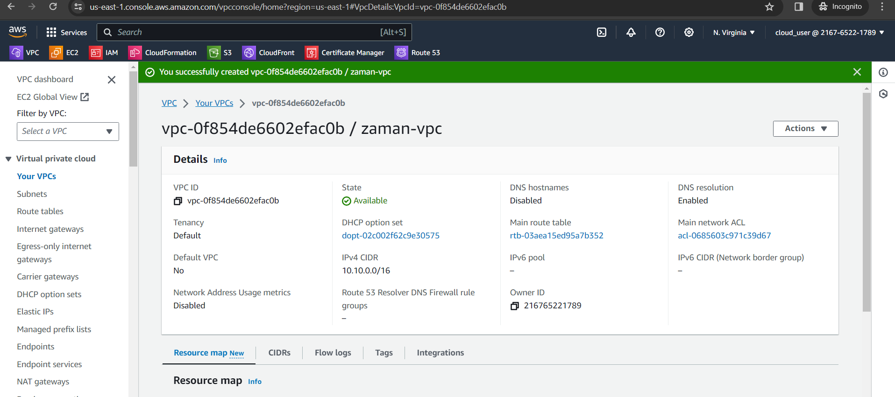
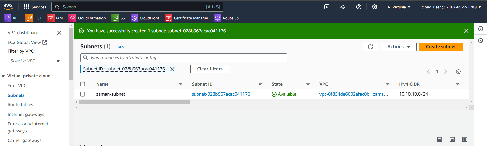
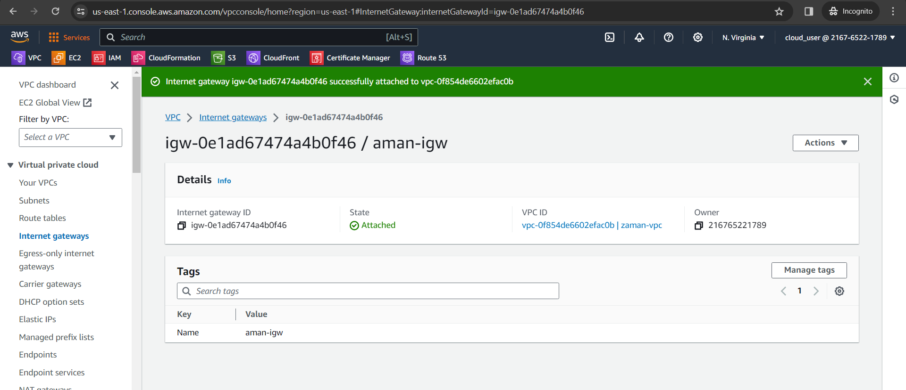
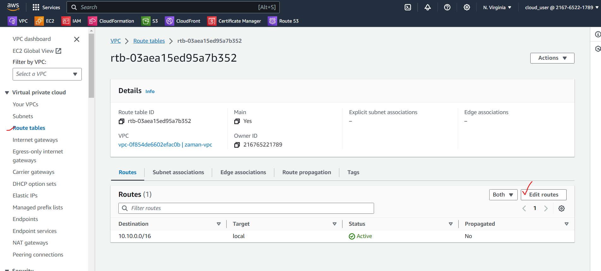
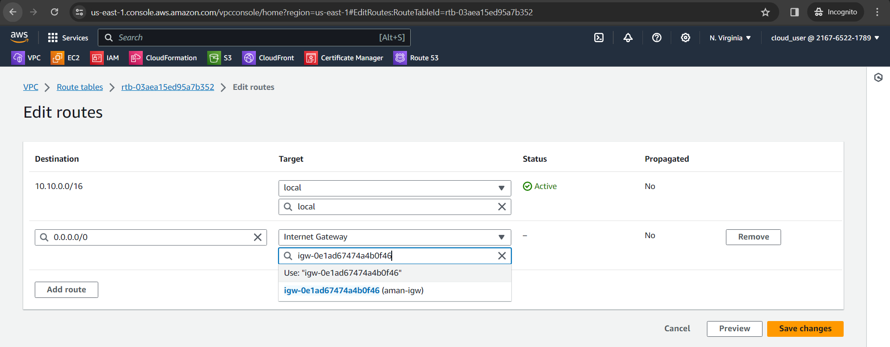
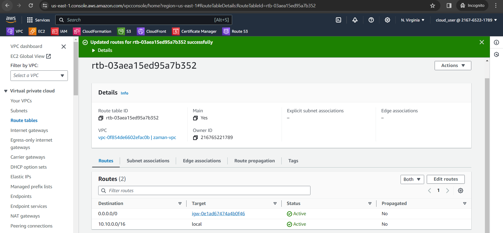
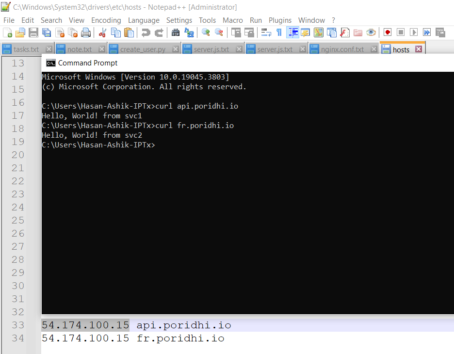
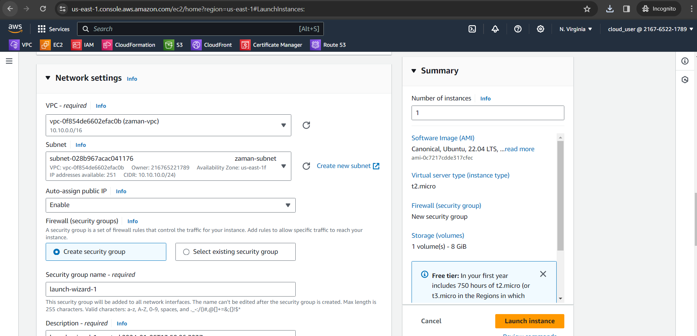
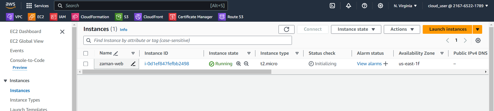
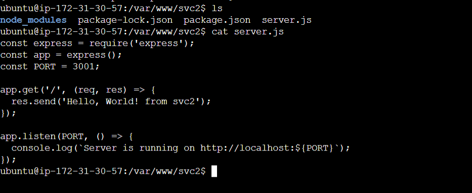

Objective:

-   Config NGINX L7 Load Balancer using single VM and deploy 2 services
    names with api.poridhi.io and fr.poridhi.io

Steps:

1.  Create VPC

{width="6.5in" height="2.8868055555555556in"}

2.  Create Subnet

{width="3.4753258967629046in"
height="4.339330708661417in"}

{width="6.5in" height="1.95in"}

3.  Create Internet Gateway and attach to the VPC

{width="6.5in" height="2.803472222222222in"}

4.  Add route 0.0.0.0

{width="6.5in" height="2.9430555555555555in"}

{width="6.5in" height="2.535416666666667in"}
{width="6.5in" height="3.0131944444444443in"}

{width="3.978478783902012in"
height="3.1028740157480317in"}

5.  Create EC2 instance

{width="6.5in" height="3.136111111111111in"}

{width="6.5in" height="1.4701388888888889in"}

6.  Installing Nginx

7.  Install Nodejs

8.  Create svc1 app

Sudo npm init

npm i express

node server.js

{width="6.5in" height="2.654166666666667in"}

9.  Configure Nginx: when request will come from api.poridhi.io and same
    ip, serve from svc1, and when come from fr.poridhi.io same ip,
    response from svc2.

nginx -t -c /etc/nginx/nginx.conf

nginx -s reload

Edit host: C:\\Windows\\System32\\drivers\\etc

{width="3.978478783902012in"
height="3.1028740157480317in"}
